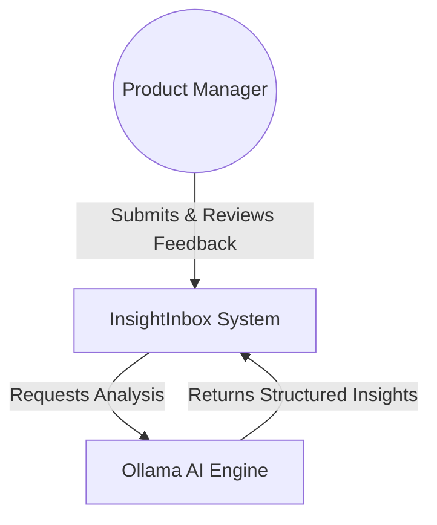
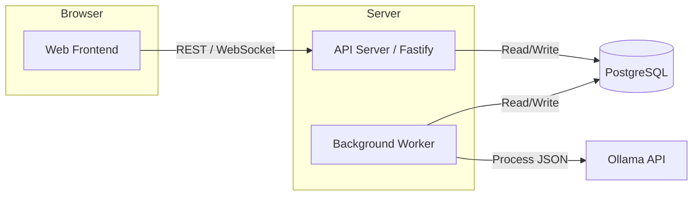
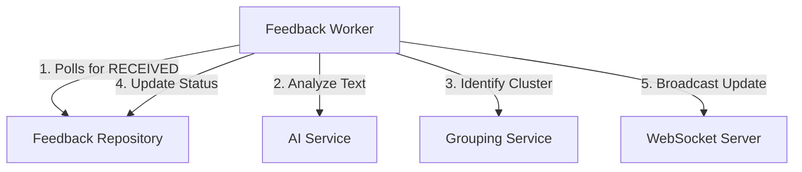
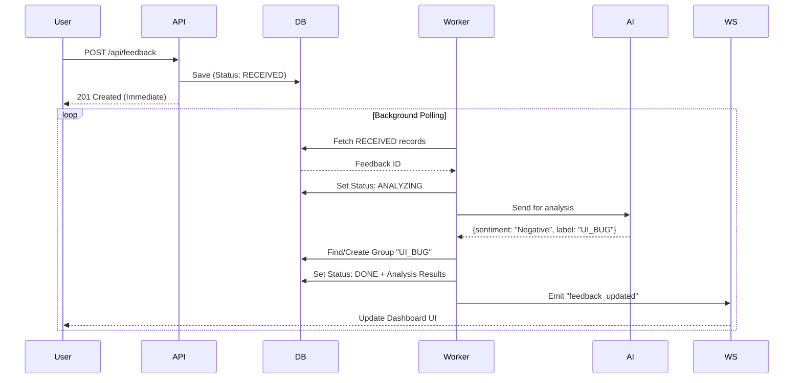
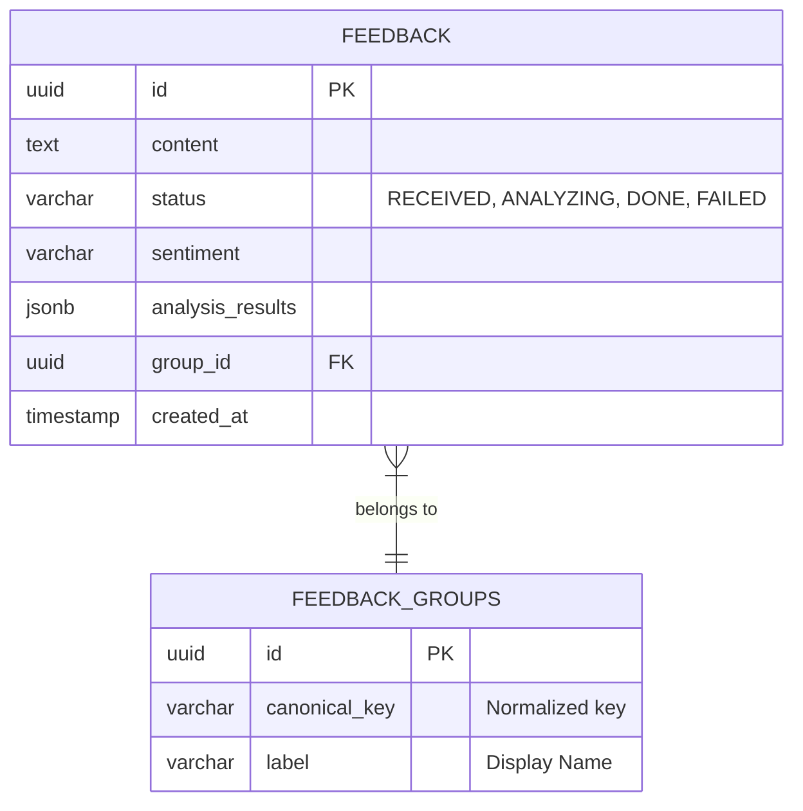

# InsightInbox - 4C Architecture

This document provides a comprehensive C4 architecture breakdown for **InsightInbox**, a robust, multilingual feedback analysis system. It is designed to scale with asynchronous processing, structured AI insights, and real-time observability.

---

## 1. Context

### Business Context
Modern organizations receive feedback across multiple channels and languages. Manually triaging this data is slow, inconsistent, and expensive. InsightInbox automates this by extracting sentiment, identifying feature requests, and grouping similar feedback into actionable clusters.

### System Purpose and Goals
- **Automation**: Reduce manual effort in feedback categorization.
- **Multilingual Support**: Handle diverse scripts without data loss.
- **Reliability**: Ensure no feedback is lost, even if AI services are transiently unavailable.
- **Operational Clarity**: Provide real-time status of analysis via a modern dashboard.

### User Personas
- **Product Manager**: Reviews high-level sentiment and grouped feature requests to prioritize the roadmap.
- **Support Lead**: Monitors the inbox for urgent negative feedback requiring escalation.
- **Developer**: Integrates the API with external data sources.

### System Context Diagram


---

## 2. Containers

### Main Containers
- **Web Frontend**: A vanilla HTML/JS application providing the dashboard and submission interface.
- **API Server**: A Fastify-based Node.js service handling REST requests and WebSocket connections.
- **Background Worker**: A dedicated process for processing feedback asynchronously to avoid blocking the user.
- **PostgreSQL Database**: Persistent storage for feedback, groups, and system state.
- **Ollama API**: A locally hosted or containerized LLM service (Llama 3.1) for text analysis.

### Container Diagram


### Deployment Topology
The system is designed for **Dockerized Deployment**.
- **Single Node (MVP)**: All containers run on a single host via Docker Compose.
- **Scaling**: The API Server and Background Worker are stateless and can be scaled horizontally. PostgreSQL and Ollama can be moved to managed services (e.g., RDS, Bedrock/Azure OpenAI) for high availability.

---

## 3. Components

### Internal Module Design
The **API Server** and **Worker** share a common domain layer but have distinct entry points.

- **Feedback Controller**: Handles HTTP inputs and input validation (Zod).
- **AI Service**: Orchestrates communication with Ollama, including prompt engineering and response parsing.
- **Grouping Service**: Implements the idempotent logic to cluster feedback based on canonical labels.
- **Repository Layer**: Encapsulates all SQL queries to ensure data consistency.
- **WS Server**: Manages real-time event broadcasting to active frontend clients.

### Component Diagram (Processing Logic)


### Sequence Diagram: Feedback Journey


---

## 4. Code

### Code Structure
```text
src/
├── app.ts            # Fastify application setup
├── server.ts         # Entry point for the API
├── db.ts             # Database connection pool
├── config.ts         # Environment variables
├── repositories/     # Data access layer (PostgreSQL)
├── services/         # Business logic (AI, Grouping)
├── routes/           # REST endpoints
├── schemas/          # Zod validation schemas
├── ws/               # WebSocket handling
└── worker/           # Background process entry point
```

### Data Model (ERD)


### Core Algorithm: Idempotent Grouping
The `GroupingService` ensures that the LLM's non-deterministic nature doesn't create duplicate groups.
```typescript
async getOrCreateGroup(aiLabel: string) {
    // 1. Normalize (e.g., "UI Bug!!" -> "ui_bug")
    const key = aiLabel.toLowerCase().trim().replace(/[^a-z0-9]/g, '_');
    
    // 2. Atomic Find or Create
    let group = await repo.findGroupByUniqueKey(key);
    if (!group) {
        group = await repo.createGroup({ key, label: aiLabel });
    }
    return group.id;
}
```

---

## 5. Visual Summary

### Architecture Visual Representations

#### Professional Light-Theme (Presentation)


#### Engineering Dark-Theme (Documentation)


#### Executive Overview (Isometric)


### Architecture Image Prompts
1. **Light-Theme**: A professional, clean architectural diagram for a cloud-native application. Features a "Web Browser" icon connecting to a "Fastify API Server" box. The server connects to a "PostgreSQL Database" icon and a "Background Worker" box. The worker connects to an "Ollama AI" cloud icon. Minimalist blue and grey color palette, high-quality vector style, clear labels in sans-serif font, arrows showing bidirectional data flow. No text artifacts, 4k, technical white background.
2. **Dark-Theme**: An engineering-grade system architecture diagram with a sleek dark theme (deep charcoal background). Components are highlighted with neon blue and purple borders. Detailed representation of "Input Path" vs "Processing Path". Shows a database icon as the central hub between an API service and a Worker service. Labeled nodes for "Zod Validation", "WebSocket Hub", and "LLM Inference Engine". Professional, high-contrast, schematic style, suitable for a GitHub README.
3. **Executive Overview**: An isometric 3D visualization of a modern tech stack. A glass-style dashboard screen on the left, connected by glowing light trails to a central "Logic Cluster" containing microservice icons. A stack of database disks in the center. An abstract "Brain" icon on the right representing AI integration. Vibrant HSL colors, glassmorphism aesthetics, premium look, suitable for an investor slide or high-level project summary.

---

## 6. Trade-offs and Assumptions

### Key Assumptions
- **Local AI Availability**: We assume the Ollama instance is either local to the container or accessible via a high-bandwidth internal network.
- **Volume of Data**: The polling-based worker is suitable for thousands of feedbacks per hour. Beyond that, a message broker like RabbitMQ or Redis would replace the polling logic.

### Trade-offs
- **Polling vs Push**: We chose polling for the background worker to keep the stack simple (no Redis dependency). This introduces a slight latency (max 1s) but significantly simplifies deployment.
- **Vanilla Frontend**: Used Vanilla JS/CSS instead of React/Vue to demonstrate "zero-dependency" logic and fast load times, fitting the "Internal Tool" use case perfectly.
- **Canonical Normalization**: We rely on string normalization for grouping. While less powerful than vector embeddings, it is 100% deterministic and requires zero extra infrastructure (no vector DB).
